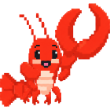
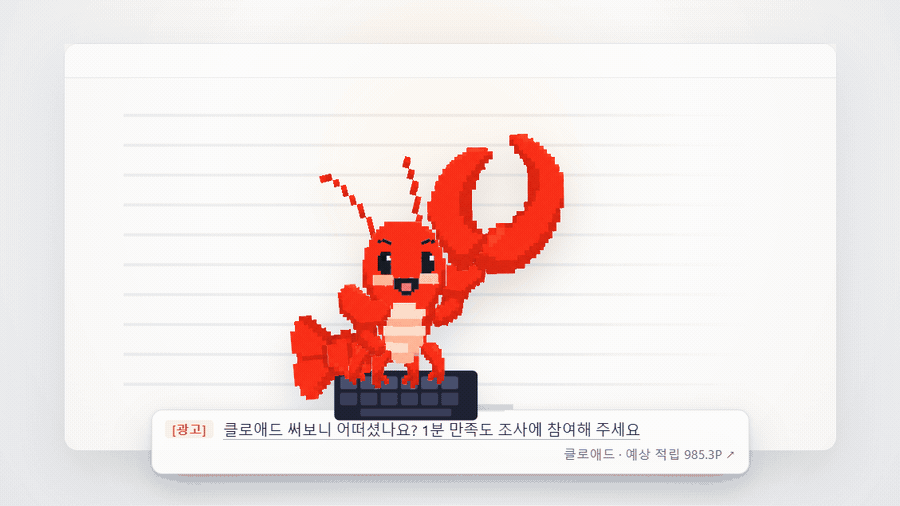

# 클로애드 (Claw-Ad)

<p align="center">
  
</p>

<p align="center">
  <a href="https://github.com/TJ-media/clawad/releases/latest"></a>
  <a href="https://www.npmjs.com/package/@clawad/cli"></a>
  
  
</p>

> 코딩하는 개발자에게, 코딩하는 순간 노출되는 광고.

<p align="center">
  
</p>

Claw-Ad는 Claude Code와 Codex를 사용하는 동안 데스크톱 캐릭터 아래에 개발자 대상 광고를 노출하고, 서버가 검증한 노출에 따라 사용자에게 비현금성 리워드를 제공합니다.

<p align="center">
  <a href="https://clawad.whatsup.house/"><strong>웹에서 체험하기</strong></a>
  &nbsp;·&nbsp;
  <a href="https://clawad.whatsup.house/install"><strong>설치하기</strong></a>
</p>

> [!IMPORTANT]
> 클로애드는 현재 **알파 테스트 단계**이며 Closed Alpha로 운영 중입니다. 기능과 정책은 운영 결과에 따라 바뀔 수 있습니다.

## 시작하기

Node.js 24 이상과 Claude Code 또는 Codex가 필요합니다. 광고 오버레이는 Windows와 macOS를 지원합니다.

macOS:

```bash
npx --yes @clawad/cli@latest setup
```

Windows PowerShell:

```powershell
npx.cmd --yes @clawad/cli@latest setup
```

설치 명령은 클라이언트와 [Claw-Ad Desktop Overlay](https://github.com/TJ-media/clawad-overlay)를 설치한 뒤 브라우저 로그인을 엽니다. **로그인 수단 선택과 약관 동의는 모두 이 화면에서 진행합니다.** 설치 후 평소처럼 Claude Code나 Codex로 작업하면 됩니다.

<details>
<summary><strong>설치 중 문제가 생겼다면</strong></summary>

먼저 `clawad status`로 설치·로그인·동기화·오버레이 상태를 확인하고 [공식 설치 안내의 문제 해결 항목](https://clawad.whatsup.house/install)을 따라 확인하세요.

예약 작업 등록에 관리자 권한은 필요하지 않습니다. 배터리로 동작할 때도 동기화가 실행됩니다. 회사에서 관리하는 Windows PC는 정책이 예약 작업 등록 자체를 막을 수 있는데, 이 경우 설치 프로그램이 실패 사유를 안내합니다.

Linux에서는 CLI만 설치되며 현재 광고 표시와 포인트 적립은 지원하지 않습니다.
</details>

## 어떻게 동작하나요?

1. 클라이언트가 표시할 광고를 미리 받아 로컬에 보관합니다.
2. AI 코딩 작업이 활성화되면 오버레이의 애드워드가 반응하고 캐릭터 아래에 `[광고]` 스폰서 메시지를 표시합니다.
3. 표시 사실만 서버로 보내며, 서버가 최소 표시 시간·중복·계정 상한을 검증해 과금과 리워드를 결정합니다.

광고 표시 창구는 데스크톱 오버레이 하나뿐이며 Claude Code의 `statusLine`을 사용하지 않습니다. 상세 규약은 [노출 검증 설계](docs/design/impression-verification.md)와 [오버레이 계약](docs/design/overlay-contract.md)에 정리되어 있습니다.

## 리워드와 개인정보

검증된 노출은 **예상 적립 → 검증 중 → 확정 리워드** 순서로 반영됩니다. 확정 포인트는 지정 상품 교환에만 사용할 수 있고 충전·양도·현금 환급은 지원하지 않습니다.

클로애드는 광고 검증에 필요한 최소한의 표시 사실만 전송합니다. **프롬프트, 모델 응답, 소스코드, 파일명·프로젝트 경로, 터미널 입력, 환경변수, 클립보드, 하드웨어 식별자는 서버로 보내지 않습니다.** 활동 감지 훅은 `session_id`만 읽습니다.

## 정책 및 개인정보

- [서비스 이용약관](https://clawad.whatsup.house/legal/terms-v2.html)
- [개인정보처리방침](https://clawad.whatsup.house/legal/privacy-v4.html)
- [데이터 처리 원칙](docs/legal/privacy-design.md)

## 더 알아보기

- [설치·제거·문제 해결](https://clawad.whatsup.house/install)
- [데스크톱 오버레이](https://github.com/TJ-media/clawad-overlay)
- [제품·보안·운영 문서](docs/README.md)
- [저장소 구조와 개발 규칙](AGENTS.md)

개발 검증은 `npm run lint`와 `npm test`로 실행합니다. 이 저장소의 소스는 [Claw-Ad Source Viewing License 1.0](LICENSE)에 따라 열람할 수 있지만 **오픈소스가 아닙니다**. 실행·수정·재배포에는 별도 서면 허가가 필요합니다. 공식 클라이언트 사용 조건은 [Claw-Ad Client Use License 1.0](LICENSE-CLIENT)을 따릅니다. 오버레이 소스는 별도 저장소에서 AGPL-3.0으로 공개합니다.

Claw-Ad는 Anthropic 또는 Claude와 제휴·후원 관계가 없는 독립 서비스입니다. 경쟁사의 비공개 자료나 원본 코드를 열람·인용·복제하지 않고 공개된 제품 설명과 독자적으로 정의한 요구사항만으로 구현합니다.

Copyright © 2026 TJ-media. All rights reserved.
