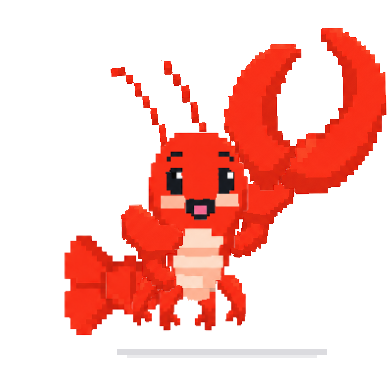
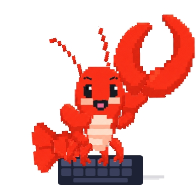
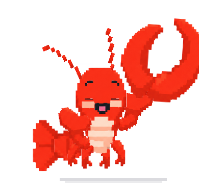

# ClawAd 마스코트 테마 설치·운영 가이드

clawd-on-desk 데스크펫 앱에서 ClawAd 픽셀 랍스터 마스코트를 사용하는 방법을 설명한다.
테마 소스는 레포의 [`mascot/`](../../mascot/) 폴더에 있으며, 배포 패키지는 `mascot/clawad-theme.zip`이다.

| idle | working | sleeping | mini-peek |
|---|---|---|---|
|  |  |  |  |

## 1. 설치

### 방법 A — zip 패키지 가져오기 (권장)

1. `mascot/clawad-theme.zip`을 받는다.
2. clawd-on-desk 트레이 아이콘 → 설정(Clawd Settings) → **테마** 탭.
3. **"Clawd 테마 패키지 가져오기 (.zip)"** 클릭 → zip 선택.
4. 테마 목록에서 **ClawAd** 카드를 선택.

이미 같은 이름의 테마가 설치돼 있으면 가져오기가 `already exists`로 실패한다.
이 경우 방법 B로 교체하거나, 기존 폴더를 지운 뒤 다시 가져온다.

### 방법 B — 테마 폴더 직접 복사 (업데이트·개발용)

1. `mascot/theme/` 폴더 내용을 `%APPDATA%\clawd-on-desk\themes\clawad\`로 복사한다.
2. 앱이 이전 버전을 캐시했을 수 있으므로 `%APPDATA%\clawd-on-desk\theme-cache\clawad\`를 삭제한다.
3. 설정 → 테마 → **"테마 새로고침"** (또는 앱 재시작).

## 2. 상태 구성 (v1.6.0, SVG 25종)

| 분류 | 상태 | 연출 |
|---|---|---|
| 기본 | idle | 숨쉬기 + 더듬이 살랑 + 집게 딸깍 + 깜빡임 + **눈동자 커서 추적** |
| 기본 | thinking | 픽셀 구름 말풍선(점 3개 순차) + 한쪽 눈썹 올림 |
| 기본 | working | 정면 키보드에 발 4개 타건, 키 눌림, 10시10분 눈썹 |
| 기본 | attention | 통통 점프 + 반짝이 |
| 기본 | notification | 대형 픽셀 느낌표(네이비 테두리) + 눈썹 쫑긋 |
| 기본 | error | 몸 흔들림 + 걱정 눈썹 + 얼굴 위로 흐르는 식은땀 |
| 수면 | yawning → dozing → collapsing → sleeping → waking | 하품 → 꾸벅꾸벅 → 잠들기 전환 → 픽셀 Zzz 수면 → 기지개 기상 (`sleepSequence.mode: "full"`) |
| working 티어 | juggling (동시 세션 2) | 모니터 2대 번갈아 보기, 코드 라인 타이핑 |
| working 티어 | building (동시 세션 3+) | 크런치 모드: 모니터 2대 + 발 연타 + 커피 감소 |
| 서브에이전트 | conducting (2개+) | 지휘봉 + 8분·연속16분음표 |
| 미니 모드 | mini-idle/enter/enter-sleep/crabwalk/peek/alert/happy/sleep | 화면 가장자리 도킹 시. peek은 오른쪽 절반이 입까지 빼꼼 |
| 리액션 | drag / clickLeft / double | 대롱대롱 매달림 / 화들짝 점프+! / 픽셀 하트 |

전체 상태를 한 페이지에서 보려면 `mascot/theme-preview.html`을 브라우저로 연다
(theme-build.js가 함께 생성하는 갤러리, 애니메이션 라이브 재생).

## 3. 커스터마이즈·빌드

```bash
cd mascot
node theme-build.js   # theme-out/clawad/ 생성 + 자체 검증 + theme-preview.html 갱신
```

- 파츠 위치·피벗·애니메이션은 전부 `theme-build.js` 안의 좌표·CSS로 관리한다 (IMG/PIVOT 테이블, 상태별 STATES 맵).
- 빌드 후 방법 B로 설치하고 캐시를 삭제해야 반영된다.
- 파츠 PNG를 바꿀 때는 `mascot/parts/`를 교체 후 재빌드한다. 눈/눈썹 분리는 `split-eyes.ps1` 참고.

## 4. 제약사항 (앱 새니타이저)

- **`data:` URI 금지** — 테마 SVG가 base64 이미지를 임베드하면 앱이 제거한다. 반드시 `assets/` 안의 PNG를 **상대경로**로 참조한다 (`.png`/`.webp`만 허용).
- `<script>`, 이벤트 핸들러 속성 금지 — 애니메이션은 CSS `@keyframes`만 사용.
- 눈동자 추적은 idle SVG의 `#eyes-js` / `#body-js` 그룹 ID를 앱 렌더러가 조작하는 방식 (eyeTracking 설정).
- `miniMode.supported: true`면 미니 상태 8종 전부 필수, `sleepSequence.mode: "full"`이면 수면 전환 4종 필수 — 검증에서 강제된다.

## 5. 버전 관리

- `theme.json`의 `version`은 semver로 관리한다. 현재 **1.6.0**.
  - 상태 추가·모드 전환 등 기능 확장: minor (1.5.x → 1.6.0)
  - 좌표·타이밍·색 보정: patch
- 릴리스 절차: `theme-build.js`에서 version 갱신 → `node theme-build.js` → zip 재생성 → `mascot/clawad-theme.zip` 교체 → 커밋.

## 6. 문제 해결

| 증상 | 원인/조치 |
|---|---|
| 가져오기 실패 `already exists` | 기존 `themes/clawad` 폴더 삭제 후 재시도 |
| 수정했는데 화면이 그대로 | `theme-cache/clawad` 삭제 후 테마 새로고침 |
| 이미지가 안 보임 | SVG가 data: URI를 쓰고 있는지 확인 — 상대경로 PNG로 교체 |
| 가져오기 검증 오류 | `node theme-build.js` 실행해 스키마 검증 메시지 확인 |
